# Notes about AZ-900 certification

## Studying the playlist from  <a href="https://www.youtube.com/watch?v=NPEsD6n9A_I&list=PLGjZwEtPN7j-Q59JYso3L4_yoCjj2syrM&ab_channel=AdamMarczak-AzureforEveryone"> Adam Marczak - Azure for Everyone. </a>

# Summary

- [Episode 1 - Cloud Computing and Vocabulary](https://github.com/AfonsoFeliciano/AZ-900-Notes/blob/main/README.md#Cloud-Computing-and-Vocabulary)
- [Episode 2 - Principle of economies of scale](https://github.com/AfonsoFeliciano/AZ-900-Notes/blob/main/README.md#Principle-of-economies-of-scale)
- [Episode 3 - CapEx vs OpEx and their differences](https://github.com/AfonsoFeliciano/AZ-900-Notes/blob/main/README.md#CapEx-vs-OpEx-and-their-differences)
- [Episode 4 - Consumption-based Model](https://github.com/AfonsoFeliciano/AZ-900-Notes/blob/main/README.md#Consumption-based-Model)
- [Episode 5 - IaaS vs PaaS vs SaaS cloud service models](https://github.com/AfonsoFeliciano/AZ-900-Notes/blob/main/README.md#IaaS-vs-PaaS-vs-SaaS-cloud-service-models)
- [Episode 6 - Public, Private & Hybrid cloud deployment models](https://github.com/AfonsoFeliciano/AZ-900-Notes/blob/main/README.md#Public-and-Private-and-Hybrid-cloud-deployment-models)
- [Episode 7 - Geographies, Regions & Availability Zones](https://github.com/AfonsoFeliciano/AZ-900-Notes/blob/main/README.md#Geographies-and-Regions-and-Availability-Zones)
- [Episode 8 - Resources, Resource Groups & Resource Manager](https://github.com/AfonsoFeliciano/AZ-900-Notes/blob/main/README.md#Resources-and-Resource-Groups-and-Resource-Manager)

## Cloud Computing and Vocabulary

### The main goals consist of describing terms such as: 

- High Availability
- Scalability
- Elasticity
- Agility
- Fault Tolerance
- Disaster Recovery

### Cloud computing

Can be defined as a delivery model for services like storage (files, databases), computer power (virtual machines using windows or Linux and web services), networking (firewalls), analytics (performance, telemetry)

### Scalability 

Increase the size of a resource. 

Vertical scaling can be divided into two terms: 
- Scaling up: increase the memory, CPU, and storage
- Scaling down: decrease the memory, CPU, storage

Horizontal scaling, which increases the amount/quantity of the resources, can be divided into two terms: 
- Scaling out: increase the amount
- Scaling in: decrease the amount

    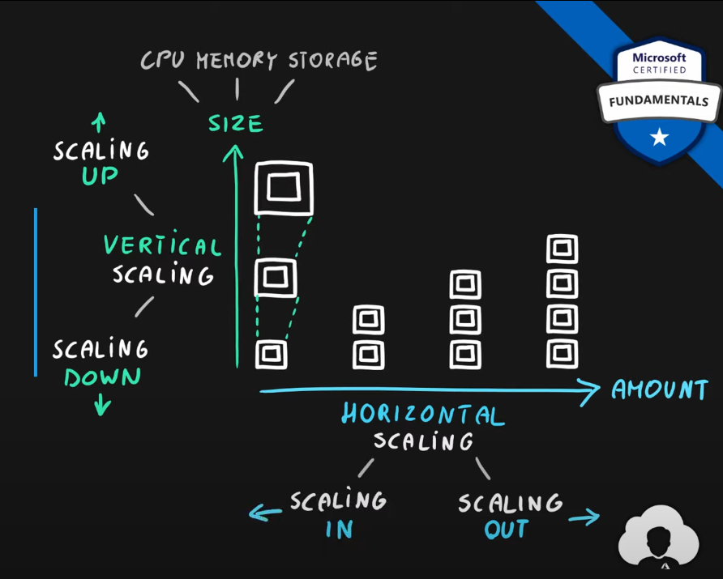

In other terms

> Scalability is the ability to scale, adding or removing resources

### Elasticity

 The workload used during the day by the users where can be automatic scaling. 

    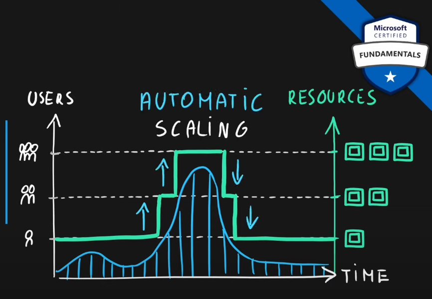

> Elasticity is the ability to scale dynamically

### Agility

The resources can be provided in two ways: manual or APIs and scripts. The main difference comparing cloud and on-premises environments is the time to finish. 

Cloud is faster than on-premises

    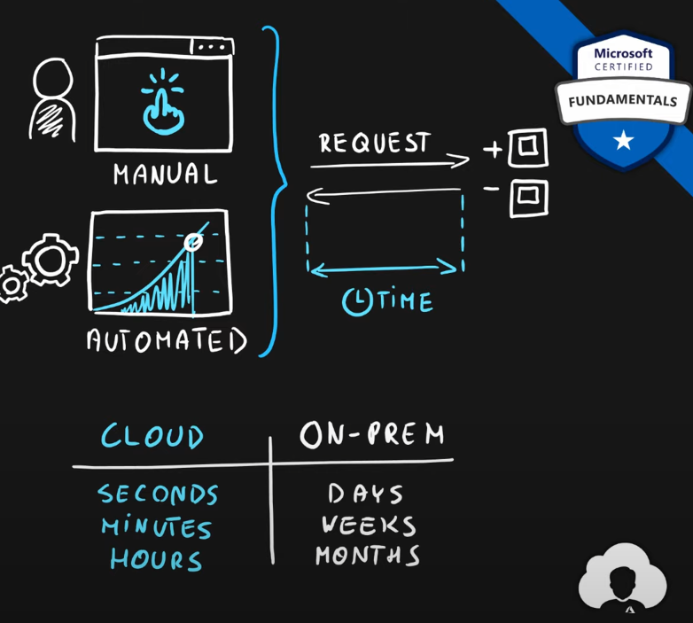

The main definition is: 

> The ability to react quickly

### Fault Tolerance One failure will not interrupt the service

> Disaster is a serious disruption of services caused by natural or human-induced causes.

Based on disaster, the term disaster recovery appears, using replication on multiple locals.

> Disaster recovery is the ability to recover from an event that has taken down the service.

### High availability 

Is a metric with measures the downtime of the services.

    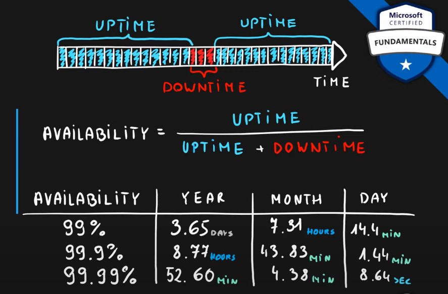

> Availability is a measure of system uptime for users/services and high availability is the ability to keep services running for extended periods of time with very little downtime.

<a href="https://marczak.io/az-900/episode-01/practice-test/"> Episode 1: Practice test </a>

## Principle of economies of scale

When the company grows in size, it becomes more effective at what they do. Thanks to this they can reduce their operating costs and therefore decrease their price per unit.

    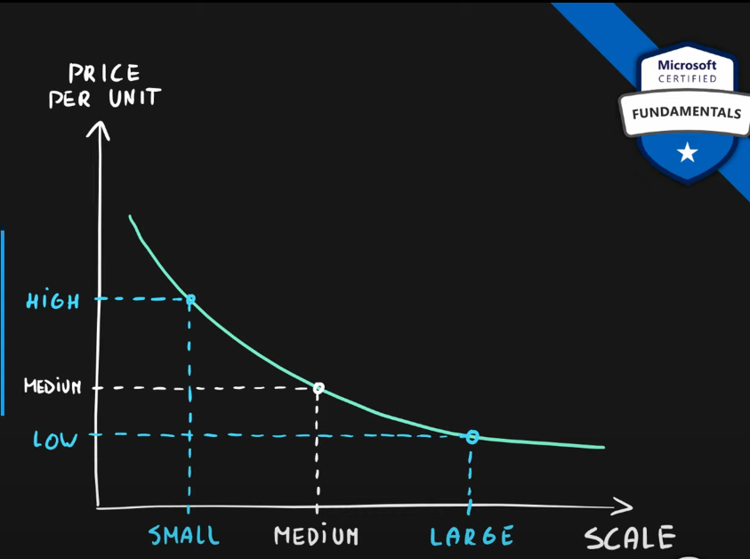

<a href="https://marczak.io/az-900/episode-02/practice-test/"> Episode 2: Practice test </a>

## CapEx vs OpEx and their differences

Main goal:

- Describe the differences between Capital Expenditure (CapEx) and Operational Expenditure (OpEx)

### CapEx

- You have your infrastructure
- You need a big initial investment
- Lost of maintenance required
1. Support Staff
2. Power & Networking
3. Hardware failures
4. others

> An action of spending company funds upfront

    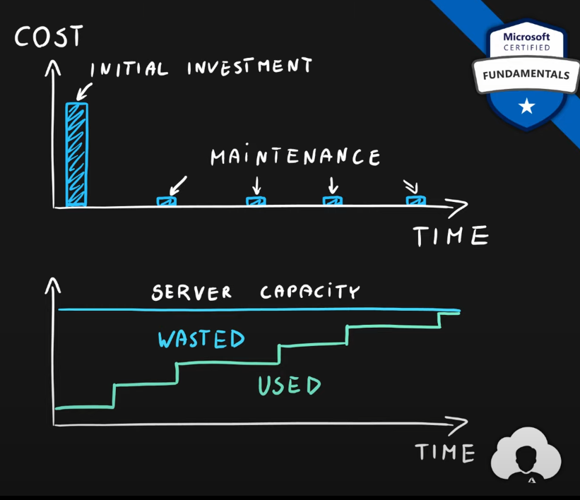

### OpEx

- Rent infrastructure
- No need for initial investment because the pay is for what is used
- Minimal maintenance
1. Operations team

    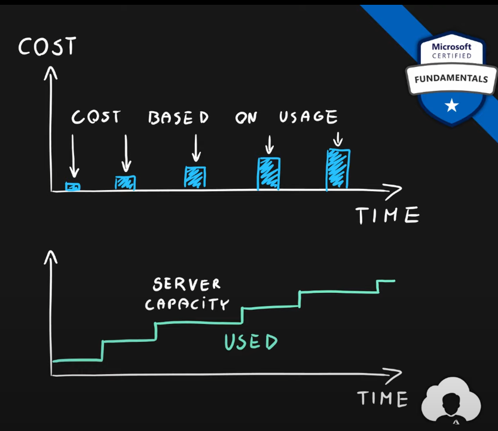

> You spend money on services every month as you use them. As such you deduct the tax in the same year. 

### Differences

| Caracteristic     | #CapEx        | #OpEx          |
| :---:             | :---:         | :---:          |
| Up front cost     | Significant   | None           |       
| Ongoing cost      | Low           | Based on Usage |
| Tax Deuction      | Over time     | Same year      |
| Early Termination | No            | Anytime        |
| maintenance       | Significant   | Low            |
| Value over time   | Lowers        | No change      |

<a href="https://marczak.io/az-900/episode-03/practice-test/"> Episode 3: Practice test </a>

## Consumption-based ModelThere are no upfront costs
- No wasted resources 
- Pay when you need the resources
- Stop paying at any time

It's possible to pay for the use from compute, storage and network. In this case, are:
- Multiple pricing components per service
- Very granular usage measurement

    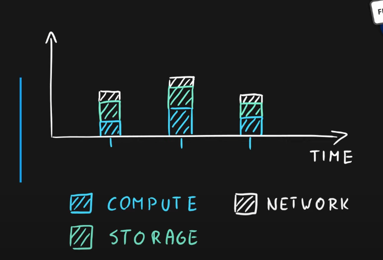

Each service in the cloud has multiple small consumption-based metrics which combined make up for the service cost. This allows the cloud provider to charge their customers appropriately for their usage. 

    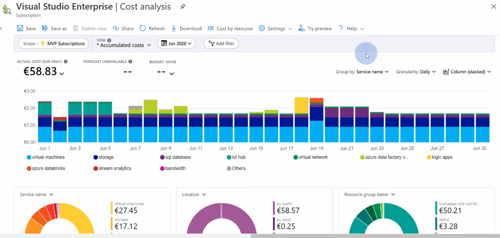

<a href="https://marczak.io/az-900/episode-04/practice-test/"> Episode 4: Practice test </a>

## IaaS vs PaaS vs SaaS cloud service models

The goals are: 
- Describe infrastructure as a service (IaaS)
- Describe Platform as a service (PaaS)
- Describe Software as a service (SaaS)
- Compare and contrast the three different service types

Differentiating the layers

    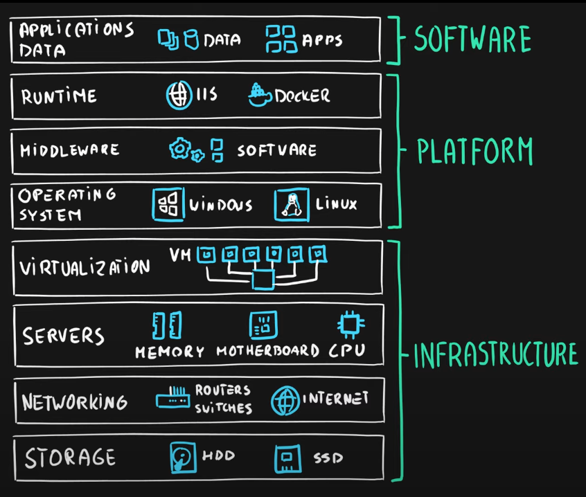

> On-Premises manage everything including infrastructure, platform and software. The infrastructure contains networking, hardware and virtualization. 
Platform contains operating system, middleware, runtime
Software contains data and applications

### IaaS

Cloud provider manages infrastructure and you manage the platform and softwares. 

Examples of use cases: 
- Migration of workloads
- Test and development
- Storage, backups and recovery

Examples of services:
- Virtual machine
- Virtual network
- Managed disk

Comments: 

> If you install SQL Server on a virtual machine manually or by using the box image, is still a virtual machine. That means customers still need to manage all of the platform aspects, including operating system settings, patches, middleware, SQL Server runtime settings, etc. As such this remains an infrastructure as a service. Azure has an option for Azure SQL Server on a virtual machine where all the updates and backups are automated but even Microsoft on their website considers this option as IaaS.

### PaaS

Cloud provider manages infrastructure and platform and you manage only the software layer

Example of use cases:
- Development framework
- Analytics and business intelligence

Examples of services:
- SQL
- App Service
- Logic Apps
- Function Apps

Comments: 

> Customers who purchase Azure SQL Databse don't need to maintain anything realted to SQL Platform because Microsoft manages that. They just use it by deploying their tables and data an consuming it with their applications. That's why is a platform as service model. It's not software as service because they still need to main the database in order for their applications to work.

### SaaS

Cloud provider manages everything (infrastructure, platform and software) and you manage nothing.

Examples of use cases:
- Buying the shell applications

Example of services:
- One drive
- Outlook
- Skype

Comments:

> Software as service means cloud provided managing everything including the application. So customers just buy the applications and licenses and use it, they don't have to maintain anything at all.

### Differences between the layers

    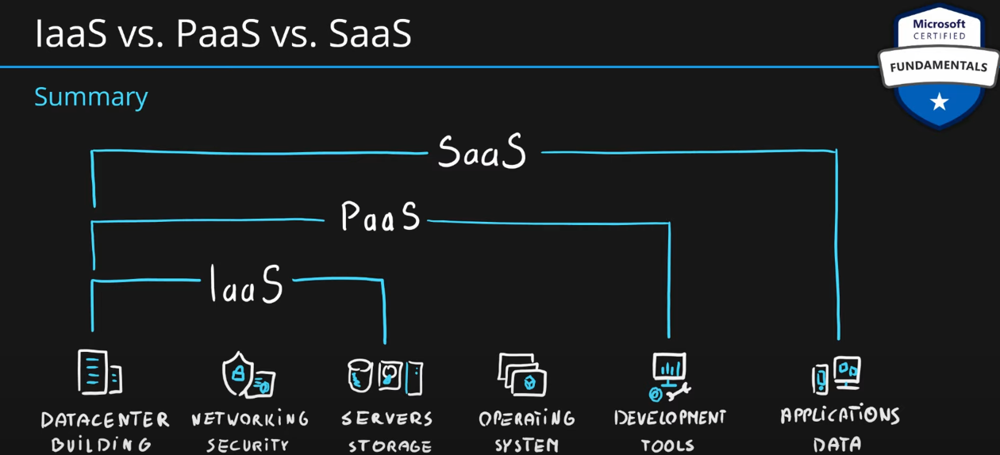

<a href="https://marczak.io/az-900/episode-05/practice-test/"> Episode 5: Practice test </a>

## Public and Private and Hybrid cloud deployment models

### Public cloud

- Everything runs on cloud-provider hardware
- No local hardware
- Some services share hardware with other customers

The advantages are: 
- No capEx
- High availability and agility
- Pay-as-you-go pricing
- No hardware maintenance
- No deep technical skills required

And the disadvantages are: 
- Security and Compliance
- Ownership
- Specific scenarios with unique business req

## Private cloud

- Everything runs on your own data center
- Self-service should be provided
- You maintain everything

The advantages are: 
- Can support any scenario
- Control over security
- Can meet any security and compliance requirements

And the disadvantages are: 
- Initial CapEx
- Limited agility
- IT skills and expertise are mandatory

## Hybrid cloud

- Combines public and private
- Offers a great flexibility

The advantages are:
- Great flexibility
- Run legacy apps in a private cloud
- Utilize existing infrastructure
- Meet any security requirements

The disadvantages are:
- Can be more expensive
- Complicated to manage
- IT skills and expertise are mandatory

<a href="https://marczak.io/az-900/episode-06/practice-test/"> Episode 6: Practice test </a>

Comments: 

> Hybrid cloud and private cloud allows to build applications with very strict security and compliance. 

> With the bybrid cloud customers can choose to use the public cloud or private cloud depending on your scenarios. Allowing customers to implemend pretty much any scenario allowing greatest degree of flexibility

> Some legacy applications might require sophisticaded physical infrastructure/software/configuration that might not be available as a public cloud offers. This means customers will require their own infrastructure to run those which make the priva cloud the best fit. But if a customer already has a public cloud they can go into a Hybrid model.

## Geographies and Regions and Availability Zones

### Data center

- Physical facility
- Hosting for a group of networked servers
- Own power, cooling and networking infrastructure

    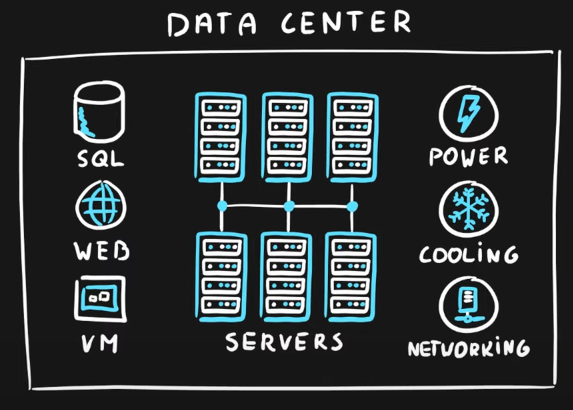

### Regions

Contains a group of data centers

    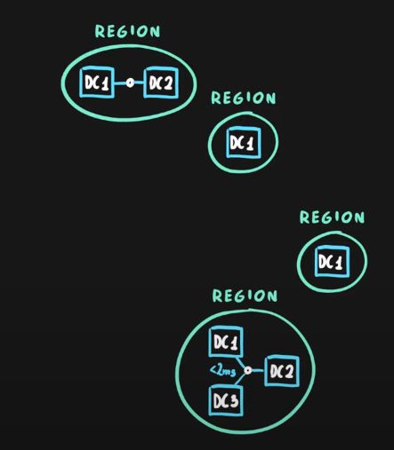

They are globally distributed

    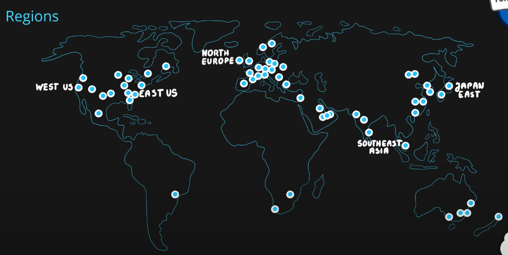

Regions' key characteristics are:

- Geographical area on the planet
- One but usually more data centers connected with low latency network (<2 milliseconds)Location for your services
- Some services are available only in certain regions
- Some services are global, as such are not assigned or deployed in a specific region
- Globally available with 50+ regions
- Special government regions (US DoD Central, US Gov Virginia, etc)
- Special partnered regions (China East, China North)

Utils: 

> Azure Speed Test 2.0 is a tool to measure the latency from your web broser to the blob storage service in each of the Microsoft Azure Data Centers https://azurespeedtest.azurewebsites.net/.

### Availability Zone

- Regional feature
- Grouping of physically separate facilities
- Designed to protect from data center failures
- If the zone goes down others continue working

Each availability zone has a number

    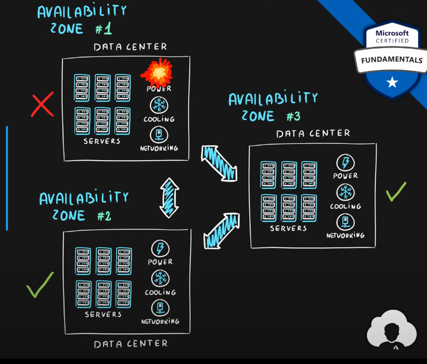

The services are split into two categories

1) Zonal services (virtual machines, disks, etc)
2) Zone redundant services (SQL, Storage, etc) replicating the data

> Not all regions are supported

> Supported region has three or more zones

### Region's pair

Each region has a region pair allow replicating data to multiple regions

    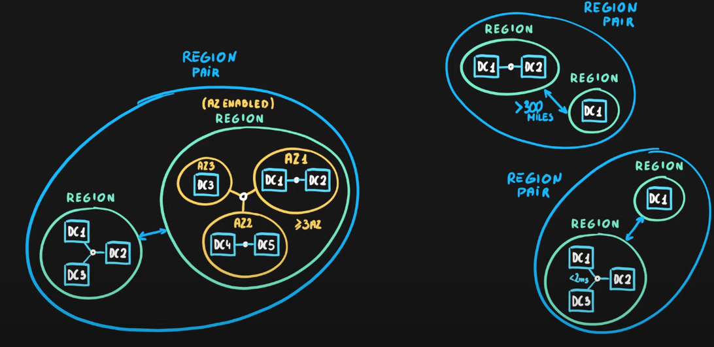

Regions pairs are static and cannot be chosen and each pair resides within the same geography except Brazil South. Furthermore physical isolation with at least 300 miles distance when is possible.

The other characteristics are: 
- Some services have platform-provided replication
- Planned updates across the pairs
- Data residency maintained for disaster recovery

Examples of region pairs

| Region Pair A             | Region Pair B                 |
| :---:                     | :---:                         | 
| East US                   | West US                       |
| UK West                   | UK South                      |
| North Europe (Ireland)    | West Europe (Netherlands)     |
| East Asia (Hong Kong)     | Southeast Asia (Singapore)    |

### Geographies

- Discrete market
- Typically contains two or more regions
- Ensure data residency, sovereignty, resiliency and compliance requirements are met
- Fault-tolerant to protect from region wide failures
- Broken up into areas
1) Americas
2) Europe
3) Asia Pacific
4) Middle East and Africa
- Each region belongs only to one Geography

    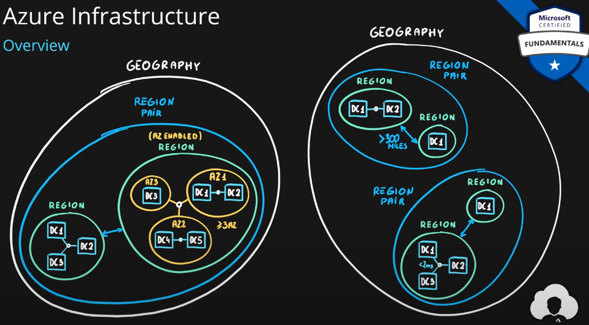

<a href="https://marczak.io/az-900/episode-07/practice-test/"> Episode 7: Practice test </a>

Comments: 

> Both region pairs and geographies are designed to be fault-tolerant and help customers replicate their solutions across regions as such allowing them to create highly available applications capable of withstanding region-wide failures

> Availability zones are physically separate facilities with indepent cooling, power and networking infrasctrucure

> Azure region typically has more than one data center, but it's not a requirement. So a minimum of one data center makes up for an Azure region

> Zone enabled region must have a minimum of three (3) availability zones

> About region pair: 1) All azure regions have a region pair; 2) Updates across region pairs are synchronized to ensure that they are not update at the same time; 3) Each region always has exaclty one pair assigned; 4) Deploying in region pairs allows customers to maintain data residency.

> |onal services allow customers to choose availability zone placement for their services

> Availability zones are designed to help customers protect from data center failures by logically grouping physically separate facilities wich have their own independent cooling, power and networking infrastructure and allowing services to take advantage of this fact.

## Resources and Resource Groups and Resource Manager

### Resources

- Objects used to manage services in Azure
- Represents service lifecycle

    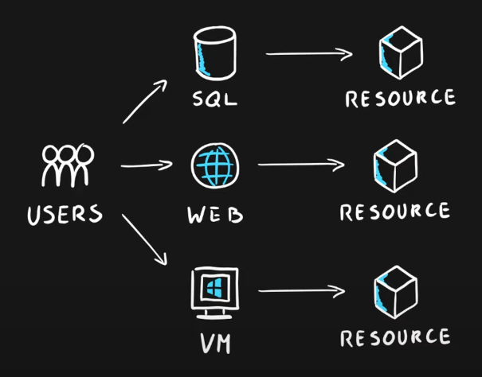

The resources are represented by a JSON template

### Resource Groups

- Grouping of resources
- Holds logically related resources

Can be organized by 
- Type
- Lifecycle (app, environment)
- Department
- Billing, location or a combination of those

    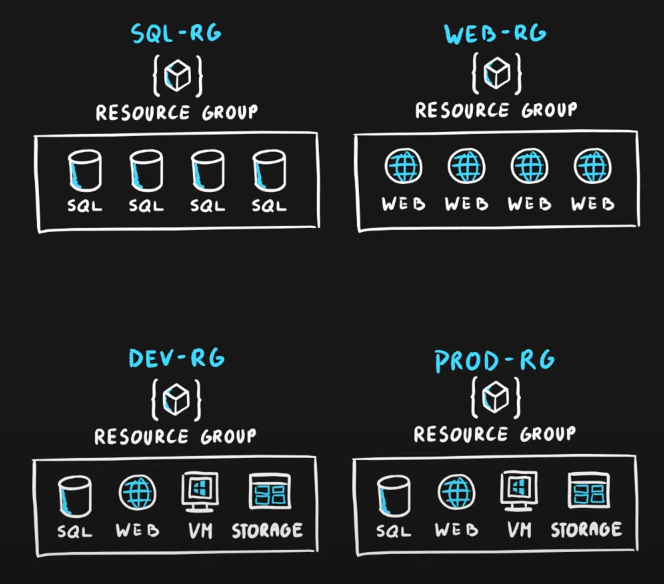

### Aditional information 

- Each resource must be in one and only one resource group 
- Resource groups have their own location assigned
- Resouces in the resource groups can reside in different locations
- Resouces can be moved between the resource groups
- Resouce groups can't be nested
- Organize based on your organization's needs but consider: billing, security and access management, application lifecycle

## Resource Manager 

Can be connected by portal, rest, power shell, CLI and SDKs

    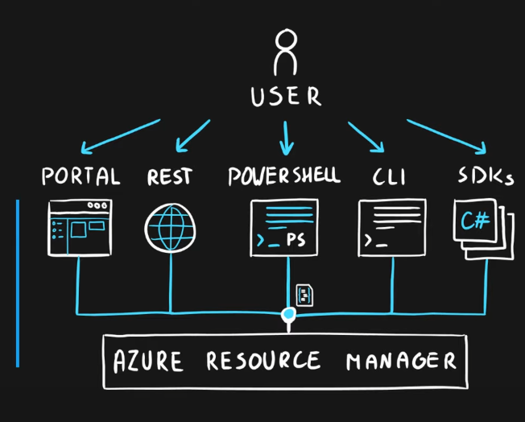

- Management layer for all resources and resource groups
- Unified language
- Controls access and resources

<a href="https://marczak.io/az-900/episode-08/practice-test/"> Episode 8: Practice test </a>

Comments

> Azure resources represent purchased azure services. While they use JSON format to do it, it's simply for purposes of storing their configuration in a commonly accepted and readable format.

> Resources groups allow services by their lifecycle, services for billing and tracking purposes, services by their resource type, services by assigned departments and services by geographical location

> Separation by application lifecycle means naming resource groups by application name and environment name. This separation strategy allows customers to have separate groups per application and environment name to assign separte privileges to their employees and vendors. As such making sure they don't impact each other while working with Azure.

